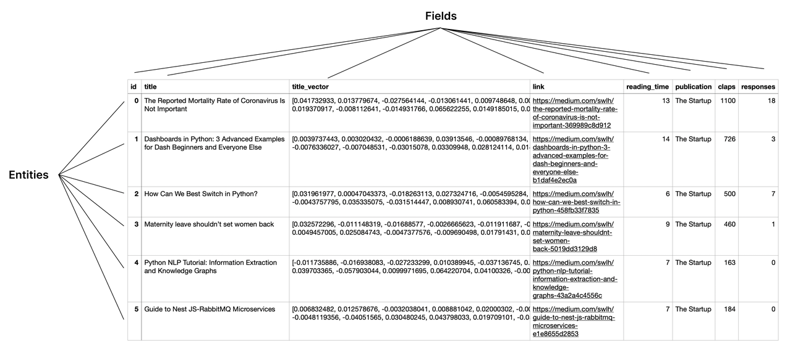

### Developing Open LLM applications with

<center>

</center>

## Lesson 6

## Vector Database

---


## Vector Database


- Vector Database

- Embedding and Search

- Importing PDF

---


---
# Milvus: concepts

- Milvus is a No-SQL database optimized for **vector searches**

  - finding **similarities** in a dataset looking at their **numeric representation**

  - text is transformed in a numeric representatino using an **embedding model** then stored

- Multiple **databases**, each database has multiple **collections**

- Each collection has a **schema** and **indexes**

---

# Access Milvus

```python
import os
from pymilvus import MilvusClient

uri = f"http://{os.getenv("MILVUS_HOST")}"
token = os.getenv("MILVUS_TOKEN")
db_name =  os.getenv("MILVUS_DB_NAME")
client = MilvusClient(uri=uri, token=token, db_name=db_name)
```
- Using Milvus
```
client.list_collections()
client.drop_collection("test")
```

---
## Collections


---

# Create Schema

- Parameters

```python
from pymilvus import DataType
COLLECTION = "test" 
DIMENSION=1024
````

- Define Schema

```python
schema = client.create_schema()
schema.add_field(field_name="id", datatype=DataType.INT64, is_primary=True, auto_id=True)
schema.add_field(field_name="text", datatype=DataType.VARCHAR, max_length=DIMENSION)
schema.add_field(field_name="embeddings", datatype=DataType.FLOAT_VECTOR, dim=DIMENSION)
```

---

# Create Index and Collection

- Define Index
```python
index_params = client.prepare_index_params()
index_params.add_index("embeddings", index_type="AUTOINDEX", metric_type="IP")
```

- Create Collection with Index and Schema

```python
client.create_collection(
     collection_name=COLLECTION, 
     schema=schema, index_params=index_params)
```

---

# Insert

```python
text = "Hello World"
vec = [float(i) for i in range(0,DIMENSION)]  # TO BE REPLACED with embedding
client.insert(COLLECTION, {"text":text, "embeddings": vec})
```

# Retrieve

```python
qit = client.query_iterator(collection_name=COLLECTION, batchSize=2, output_fields=["text"])
res = qit.next()
print(res[0].get("text"))
```
`Hello World`

---


---

# Embedding

- Use an embedding model
```python
import sys, requests as req
MODEL="mxbai-embed-large:latest"
DIMENSION=1024
```

- Invoke the embeeding API
```python
inp = "Hello World"
url = f"https://{os.getenv("AUTH")}@{os.getenv("OLLAMA_HOST")}/api/embeddings"
msg = { "model": MODEL, "prompt": inp, "stream": False }
res = req.post(url, json=msg).json()
out = res.get('embedding', [])
```
---

# VectorDB with embedding
- Using the `VectorDB` class
```python
!code packages/vdb/load/vdb.py
import sys ; sys.path.append("packages/vdb/load")
import vdb
db = vdb.VectorDB({})
```
- Insert text with embedding
```python
db.insert("Hello World")
db.insert("This is a test")
db.insert("This is another test")
db.insert("Testing")
```

---
### Vector Search
- Prepare
```python
text = "Test"
vec = db.embed(text)
```
- Execute the actual search
```python
cur = client.search(collection_name=COLLECTION, # collection
   search_params={"metric_type": "IP"},         # how to measure distance
   anns_field="embeddings",                     # where to search
   data=[vec],                                  # what to search
   output_fields=["text"]                       # field to return
)
```

---
### Vector Search results

```python
for item in cur[0]:
     dist = item.get('distance', 0)
     text = item.get("entity", {}).get("text", "")
     print(dist, text)

```

`271.28466796875 Testing`
`252.88241577148438 This is a test`
`231.84872436523438 This is another test`
`181.67494201660156 Hello World`

 Note output is ordered by **distance**

---
### `vdb/load` action


 Using command line

```
!ops invoke vdb/load input="openserverless cli import"
!ops invoke vdb/load input="*openserverless" | jq .body.output
```

Looking at code

```
!code packages/vdb/load/vdb.py
!code packages/vdb/load/load.py 
```

---


---

### Extract content from PDF files

Pages from a PDF
```python
import pymupdf
doc = pymupdf.open("lessons/bitcoin.pdf")  # load a file
text = doc[0].get_text()                  # extract text from page
```
Split in sentences
```python
import nltk.data
nltk.download('punkt')                   # load tokenizer model
from nltk.tokenize import sent_tokenize
sentences = sent_tokenize(text)          # extract sentences from text
enum = enumerate(sentences, 1)           # enumerate
sent = next(enum)                        # extract one sentence
```

---
# ops ai loader

```
!ops ai loader
```
`ai loader [--action=<action>] <file>...`
```
!ops ai loader lessons/bitcoin.pdf
```
`>>> converting lessons/bitcoin.pdf`
`saved lessons/bitcoin.pdf.txt`

---

# Excercise: import from the web

- Add to the `vdb/load` the ability to import content from http pages providing an `https://` url

Hints:

- process `input` starting with `https://`
- use `requests` to read the url content
- use `BeautifulSoap (bs4)` to process the content and extract text
- Tokenize text with regular expressions: 
https://stackoverflow.com/questions/75253187/tokenizing-the-text-without-the-use-of-libraries


https://www.nytimes.com/2025/03/24/business/economy/trump-tariffs-us-exporters.html


    